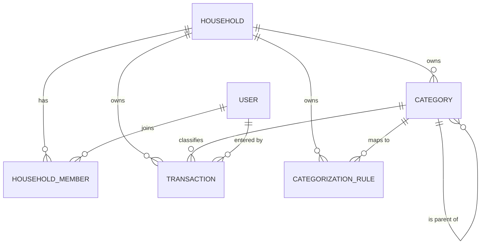

# Phase 1 — Data Model: Phân Loại Giao Dịch (Go + Vue, PostgreSQL tự quản)

**Date**: 2026-07-10 · **Feature**: 001-transaction-categorization · **Plan**: [plan.md](./plan.md)

Mô hình dữ liệu PostgreSQL cho sổ chung hộ gia đình (nhiều thành viên, ngang quyền). Khớp
[entity-model.md](../entities/entity-model.md); khác bản Supabase cũ: `users` kiêm credentials
(bcrypt), KHÔNG còn RLS (phạm vi hộ ở tầng API — research D5), trigger nghiệp vụ chuyển về biz (D3).

## Sơ đồ thực thể (phạm vi tính năng)

## USER (`users`) — kiêm đăng nhập

| Field | Type (Postgres) | Validation / Ràng buộc | Nguồn |
|-------|-----------------|------------------------|-------|
| id | uuid (PK, default gen_random_uuid()) | Primary Key | FR-015/002 |
| email | citext/text | Not Null, **Unique**, format email (validate ở biz) | FR-016/002 |
| display_name | text | Not Null (fallback = email khi hiển thị) | UC-TRK-01 5a |
| password_hash | text | Not Null (bcrypt — không bao giờ trả về qua API) | D4 |
| created_at | timestamptz | Not Null, default now() | — |

## HOUSEHOLD (`households`)

| Field | Type | Ràng buộc | Nguồn |
|-------|------|-----------|-------|
| id | uuid (PK) | Primary Key | — |
| name | text | Not Null | — |
| created_by | uuid (FK → users.id) | Not Null | — |
| created_at | timestamptz | Not Null, default now() | — |

## HOUSEHOLD_MEMBER (`household_members`)

| Field | Type | Ràng buộc | Nguồn |
|-------|------|-----------|-------|
| household_id | uuid (FK → households.id) | Not Null; PK kép cùng user_id | FR-018 |
| user_id | uuid (FK → users.id) | Not Null; PK kép cùng household_id | FR-018 |
| joined_at | timestamptz | Not Null, default now() | — |

**Constraints**: PK kép `(household_id, user_id)`. Không cột vai trò — ngang quyền (FR-021). MVP: mỗi user một hộ.

## CATEGORY (`categories`)

| Field | Type | Ràng buộc | Nguồn |
|-------|------|-----------|-------|
| id | uuid (PK) | Primary Key | — |
| household_id | uuid (FK → households.id) | Not Null; index | FR-018 |
| name | text | Not Null; cảnh báo trùng trong (household_id, type, parent_id) — biz | FR-003, FR-017 |
| type | text | Not Null; CHECK ∈ {`INCOME`,`EXPENSE`}; **bất biến sau insert — biz** | FR-004, FR-005 |
| icon | text | Optional | FR-003 |
| parent_id | uuid (FK → categories.id) | Optional; **chỉ trỏ danh mục gốc (1 cấp) — biz** | FR-010 |
| is_default | boolean | Not Null, default false | FR-001, FR-007 |
| is_hidden | boolean | Not Null, default false | FR-020 |
| created_by | uuid (FK → users.id) | Optional (audit) | FR-022 |
| created_at | timestamptz | Not Null, default now() | — |
| updated_at | timestamptz | Not Null; mốc lạc quan — biz/GORM hook cập nhật | D6 |

**State (`is_hidden`)**: `visible ⇄ hidden` (UC-CAT-06); ẩn không hiện khi chọn cho giao dịch mới, giữ nguyên lịch sử/báo cáo.

## TRANSACTION (`transactions`) — phần liên quan phân loại (001 tối thiểu)

| Field | Type | Ràng buộc | Nguồn |
|-------|------|-----------|-------|
| id | uuid (PK) | Primary Key | — |
| household_id | uuid (FK → households.id) | Not Null; index | FR-018 |
| created_by | uuid (FK → users.id) | **Not Null** — biz gán từ phiên đăng nhập | FR-022 |
| amount | numeric(14,2) | Not Null; CHECK `> 0` | BR-TRK-001 |
| type | text | Not Null; CHECK ∈ {`INCOME`,`EXPENSE`}; **= type danh mục — biz** | BR-TRK-002, FR-014 |
| category_id | uuid (FK → categories.id) | **Not Null** — không giao dịch mồ côi | FR-013, SC-002 |
| description | text | Optional; ≤ 255 — biz | BR-TRK-004 |
| transaction_date | timestamptz | Not Null, default now() | BR-TRK-005 |

> Feature 002 sẽ mở rộng: `account_id`, `updated_at`, chặn ngày tương lai, vòng đời sửa/xóa.

## CATEGORIZATION_RULE (`categorization_rules`)

| Field | Type | Ràng buộc | Nguồn |
|-------|------|-----------|-------|
| id | uuid (PK) | Primary Key | — |
| household_id | uuid (FK → households.id) | Not Null | FR-015, FR-018 |
| keyword | text | Not Null (chuẩn hóa lowercase — biz) | FR-015 |
| category_id | uuid (FK → categories.id) | Not Null | FR-015 |
| match_count | integer | Not Null, default 0, CHECK ≥ 0 | FR-015 |
| created_at | timestamptz | Not Null, default now() | — |

**Constraints**: unique `(household_id, keyword, category_id)` để upsert học lịch sử (D7); gợi ý luôn cùng loại với giao dịch đang nhập — biz.

## Bất biến xuyên thực thể → nơi thực thi

| Bất biến | Thực thi | Truy vết |
|----------|----------|----------|
| Giao dịch có đúng một danh mục cùng loại, cùng hộ | biz (validate trong tx) + `category_id NOT NULL` | FR-013/014, SC-002/003 |
| Loại danh mục cố định sau tạo | biz (từ chối đổi `type` khi update) | FR-005 |
| Con một cấp, kế thừa loại cha | biz (kiểm `parent_id` là gốc; gán type = type cha) | FR-010/011, SC-008 |
| Xóa không để giao dịch mồ côi | biz delete-reassign trong MỘT DB transaction (D12) | FR-008/009/012, SC-007 |
| Chia sẻ trong hộ, cô lập giữa hộ | middleware household scope + mọi query filter `household_id` (D5) | FR-018 |
| Ngang quyền | không cột role; chỉ kiểm membership | FR-021 |
| Không ghi đè thầm lặng | `updated_at` + conditional UPDATE/DELETE (D6) | quickstart #16 |
| Đổi tên/icon phản ánh mọi nơi | giao dịch tham chiếu `category_id` (không sao chép tên) | FR-016 |
| Credentials an toàn | bcrypt trong `password_hash`; không select ra API | D4 |

## History

- 2026-07-10: Viết lại cho stack Go + Vue (re-platform): `users` kiêm credentials; bỏ RLS/trigger — bất biến chuyển về biz layer (research D3/D5/D6); thêm unique cho `categorization_rules` phục vụ upsert. Cấu trúc thực thể & quan hệ giữ nguyên bản 2026-06-29/07-06 (xem git history).
