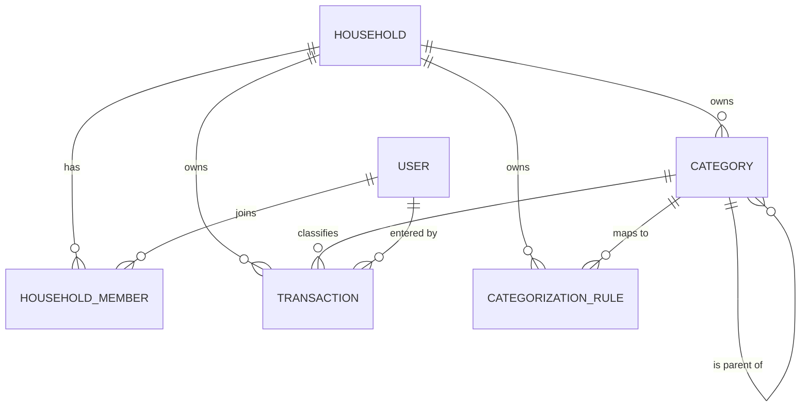

# Phase 1 — Data Model: Phân Loại Giao Dịch (sổ chung hộ gia đình)

**Date**: 2026-06-29 · **Feature**: 001-transaction-categorization · **Plan**: [plan.md](./plan.md)

Mô hình dữ liệu (Supabase/PostgreSQL) cho app **dùng chung trong hộ gia đình, nhiều thành viên, quyền ngang nhau**. So với [entity-model.md](../entities/entity-model.md): danh mục/giao dịch/quy tắc nay thuộc **hộ** (`household_id`) thay vì người dùng; thêm `households` + `household_members`. (entity-model.md nên được cập nhật tương ứng — xem plan.md.)

## Sơ đồ thực thể (phạm vi tính năng)

> `USER` = `auth.users` của Supabase. Cô lập dữ liệu **giữa các hộ** bằng RLS theo membership (FR-018 đã đổi: chia sẻ trong hộ). `TRANSACTION` mô hình phần liên quan phân loại (đầy đủ ở BR-002).

## HOUSEHOLD (`households`)

Một hộ gia đình — đơn vị sở hữu chung danh mục và giao dịch.

| Field | Type (Postgres) | Validation / Ràng buộc | Nguồn |
|-------|-----------------|------------------------|-------|
| id | uuid (PK, default gen_random_uuid) | Primary Key | R10 |
| name | text | Not Null | R10 |
| created_by | uuid (FK → auth.users) | Not Null (người tạo hộ) | R10 |
| created_at | timestamptz | Not Null, default now() | — |

## HOUSEHOLD_MEMBER (`household_members`)

Liên kết người dùng ↔ hộ. **Không có vai trò gác quyền** (mọi thành viên ngang quyền — R11).

| Field | Type (Postgres) | Validation / Ràng buộc | Nguồn |
|-------|-----------------|------------------------|-------|
| household_id | uuid (FK → households.id) | Not Null; PK cùng user_id | R10 |
| user_id | uuid (FK → auth.users) | Not Null; PK cùng household_id | R10 |
| joined_at | timestamptz | Not Null, default now() | R11 |

**Constraints**: PK kép `(household_id, user_id)` — mỗi người chỉ vào một hộ một lần. MVP giả định mỗi user thuộc một hộ.

## CATEGORY (`categories`)

Nhóm phân loại Thu/Chi dùng chung trong hộ, mặc định hoặc tự tạo, lồng một cấp.

| Field | Type (Postgres) | Validation / Ràng buộc | Nguồn |
|-------|-----------------|------------------------|-------|
| id | uuid (PK) | Primary Key | — |
| household_id | uuid (FK → households.id) | Not Null; RLS theo membership | FR-018(đã đổi), R10 |
| name | text | Not Null; cảnh báo trùng trong (household_id, type, parent_id) | FR-003, FR-017 |
| type | text | Not Null; ∈ {`INCOME`,`EXPENSE`}; **bất biến sau insert** | FR-004, FR-005 |
| icon | text | Optional | FR-003 |
| parent_id | uuid (FK → categories.id) | Optional; chỉ trỏ tới danh mục cấp gốc (một cấp) | FR-010 |
| is_default | boolean | Not Null, default false | FR-001, FR-007 |
| is_hidden | boolean | Not Null, default false | FR-020 |
| created_by | uuid (FK → auth.users) | Optional (audit: ai tạo) | R14 |
| created_at | timestamptz | Not Null, default now() | — |
| updated_at | timestamptz | Not Null, default now(); trigger touch mỗi lần UPDATE — mốc cập nhật lạc quan | R13 |

**Constraints**
- `chk_type`: `type IN ('INCOME','EXPENSE')`.
- `chk_one_level` + `trg_inherit_type`: con chỉ dưới danh mục gốc; con kế thừa `type` của cha — FR-010, FR-011, SC-008.
- `trg_type_immutable`: chặn đổi `type` — FR-005.
- Cảnh báo (không cứng) trùng `name` trong `(household_id, type, parent_id)` — FR-017.

**State (is_hidden)**: `visible ⇄ hidden`, đảo ngược (UC-CAT-06); ẩn không hiện khi nhập giao dịch mới nhưng giữ lịch sử/báo cáo của cả hộ.

## TRANSACTION (`transactions`) — phần liên quan phân loại

Bút toán Thu/Chi dùng chung trong hộ, tham chiếu đúng một danh mục cùng loại, ghi rõ thành viên nhập.

| Field | Type (Postgres) | Validation / Ràng buộc | Nguồn |
|-------|-----------------|------------------------|-------|
| id | uuid (PK) | Primary Key | — |
| household_id | uuid (FK → households.id) | Not Null; RLS theo membership | R10 |
| created_by | uuid (FK → auth.users) | **Not Null** (thành viên đã nhập) | R14 |
| amount | numeric(14,2) | Not Null; `> 0` | BR-TRK-001 |
| type | text | Not Null; ∈ {`INCOME`,`EXPENSE`} | BR-TRK-002 |
| category_id | uuid (FK → categories.id) | **Not Null** | FR-013, BR-TRK-003 |
| description | text | Optional, ≤ 255 ký tự | BR-TRK-004 |
| transaction_date | timestamptz | Not Null, default now() | BR-TRK-005 |

**Constraints**
- `chk_amount_positive`: `amount > 0`.
- `trg_type_match`: `transactions.type` = `categories.type` của `category_id` — FR-014, SC-003.
- `chk_same_household`: `category_id` phải thuộc cùng `household_id` (danh mục và giao dịch cùng hộ).
- `category_id` NOT NULL ⇒ không giao dịch mồ côi — FR-013, SC-002.
- Xóa danh mục qua RPC gán-lại/xóa (không cascade ngầm) — FR-008, SC-007.

## CATEGORIZATION_RULE (`categorization_rules`)

Ánh xạ từ khóa → danh mục để gợi ý, **dùng chung & học từ lịch sử chung của hộ**; tham khảo, ghi đè được.

| Field | Type (Postgres) | Validation / Ràng buộc | Nguồn |
|-------|-----------------|------------------------|-------|
| id | uuid (PK) | Primary Key | — |
| household_id | uuid (FK → households.id) | Not Null; RLS theo membership | R10, FR-015 |
| keyword | text | Not Null | FR-015 |
| category_id | uuid (FK → categories.id) | Not Null | FR-015 |
| match_count | integer | Not Null, default 0, `>= 0` | FR-015 |
| created_at | timestamptz | Not Null, default now() | — |

**Constraints**: gợi ý cùng `type` với giao dịch đang nhập; không ép buộc (người dùng ghi đè được) — FR-015.

## Quy tắc toàn vẹn xuyên thực thể (tóm tắt → truy vết)

| Bất biến | Thực thi | Truy vết |
|----------|----------|----------|
| Mỗi giao dịch có đúng một danh mục cùng loại | `category_id NOT NULL` + `trg_type_match` | FR-013, FR-014, SC-002, SC-003 |
| Loại danh mục cố định sau khi tạo | `trg_type_immutable` | FR-005 |
| Danh mục con kế thừa loại của cha, một cấp | `trg_inherit_type` + `chk_one_level` | FR-010, FR-011, SC-008 |
| Xóa không để lại giao dịch mồ côi | RPC `delete_category` | FR-008, FR-009, FR-012, SC-007 |
| **Dữ liệu dùng chung trong hộ, cô lập giữa các hộ** | **RLS theo membership** `is_member(household_id)` | FR-018 (đã đổi), R10, R12 |
| Đổi tên/biểu tượng phản ánh mọi nơi | Giao dịch tham chiếu `category_id` | FR-016 |
| Ghi rõ thành viên nhập giao dịch | `transactions.created_by` | R14 |
| Mọi thành viên ngang quyền | Không cột role gác quyền; RLS chỉ kiểm membership | R11 |
| Không ghi đè thầm lặng khi hai thành viên sửa cùng danh mục | `categories.updated_at` + client ghi có điều kiện (0 hàng khớp → báo xung đột) | R13 |

## History

- 2026-07-06: Thêm `categories.updated_at` + trigger touch (cập nhật lạc quan đa thành viên — R13, task T050). Đồng bộ với `contracts/db-schema.sql` và migration `0010_updated_at.sql`.
