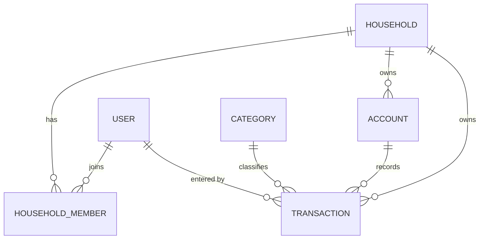

# Phase 1 — Data Model: Ghi Chép Thu Nhập và Chi Phí (Go + Vue, PostgreSQL tự quản)

**Date**: 2026-07-10 · **Feature**: 002-transaction-tracking · **Plan**: [plan.md](./plan.md) ·
**Nguồn**: [entity-model.md](../entities/entity-model.md) · [spec.md](./spec.md) · [research.md](./research.md)

Phần MỚI/MỞ RỘNG của feature 002 trên nền [data-model 001 (Go+Vue)](../001-transaction-categorization/data-model.md)
— `users` (kiêm credentials), `households`, `household_members`, `categories`, `categorization_rules`
giữ nguyên theo 001. Không RLS/trigger — bất biến ở tầng biz (research 001 D3/D5).

## Sơ đồ thực thể (phạm vi feature)

## ACCOUNT (`accounts`) — migration `00006_accounts.sql` (mới)

Nguồn tiền của hộ mà giao dịch được ghi vào (thu gọn từ BR-005 — D13).

| Field | Type (Postgres) | Validation / Ràng buộc | Nguồn |
|-------|-----------------|------------------------|-------|
| id | uuid (PK, default gen_random_uuid()) | Primary Key | — |
| household_id | uuid (FK → households.id) | Not Null; index; phạm vi hộ ở API | FR-006, D13 |
| name | text | Not Null (vd "Tiền mặt") | BR-ACC-002 |
| type | text | Not Null; CHECK ∈ {`CASH`,`BANK`,`EWALLET`,`CREDIT`}; default `CASH` | BR-ACC-001 |
| initial_balance | numeric(14,2) | Not Null, default 0 — BR-005 dùng sau | BR-ACC-002 |
| created_by | uuid (FK → users.id) | Optional (audit; biz gán từ phiên) | FR-022/001 |
| created_at | timestamptz | Not Null, default now() | — |

**Constraints**: Tài khoản mặc định "Tiền mặt" tạo bằng **app logic** `SeedDefaults` khi hộ được tạo
(+ backfill trong `cmd/seed`) → hộ luôn có ≥ 1 tài khoản (edge case spec; D13). 002 chỉ **đọc**
accounts (list + chọn trong form); tạo/sửa/xóa tài khoản thuộc BR-005.

## TRANSACTION (`transactions`) — migration `00007_transactions_v2.sql` (mở rộng bảng 001)

Bút toán Thu/Chi đầy đủ vòng đời nhập/sửa/xóa.

| Field | Type (Postgres) | Validation / Ràng buộc | Nguồn |
|-------|-----------------|------------------------|-------|
| *(giữ từ 001)* id, household_id, created_by, amount, type, category_id, description, transaction_date | — | amount > 0 (CHECK); type ∈ INCOME/EXPENSE (CHECK); category NOT NULL, cùng loại & cùng hộ (**biz**); description ≤ 255 (**biz**) | FR-001…004, FR-007 |
| **account_id** (MỚI) | uuid (FK → accounts.id, on delete restrict) | **Not Null** (backfill về tài khoản mặc định của hộ trước khi siết); cùng hộ với giao dịch (**biz**) | FR-006, BR-TRK-006 |
| **updated_at** (MỚI) | timestamptz | Not Null, default now(); GORM hook cập nhật — mốc lạc quan | FR-014, D17 |

**Bất biến mới (biz — trong DB transaction)**
- `transaction_date` không ở tương lai (nới +1 ngày múi giờ) → `FUTURE_DATE_NOT_ALLOWED` (FR-005, D15).
- `account_id` bắt buộc, thuộc cùng hộ → `ACCOUNT_REQUIRED` / `ACCOUNT_HOUSEHOLD_MISMATCH` (FR-006/007).
- PATCH/DELETE kèm `expected_updated_at` — conditional write, phân biệt `CONCURRENCY_CONFLICT` vs `RECORD_GONE` (FR-014, D17).
- Đổi loại khi sửa → buộc chọn lại danh mục cùng loại (FR-009, D18 — validate type-match chạy cho cả update).

## ACCOUNT_BALANCES (view) — trong `00006_accounts.sql`

Số dư suy ra — luôn khớp tổng bút toán (SC-004, D14).

| Field | Type | Định nghĩa |
|-------|------|-----------|
| account_id | uuid | = accounts.id |
| household_id | uuid | = accounts.household_id (lọc theo hộ ở API) |
| balance | numeric | `initial_balance + Σ(amount × CASE type WHEN 'INCOME' THEN 1 ELSE -1 END)` trên giao dịch của tài khoản |

**Constraints**: view thường (không materialized), tạo bằng `-- +goose StatementBegin/End`; GORM map
model **read-only**; index `idx_transactions_account(account_id)` phục vụ tổng hợp.

## Quy tắc toàn vẹn xuyên thực thể (tóm tắt → truy vết)

| Bất biến | Thực thi | Truy vết |
|----------|----------|----------|
| Giao dịch đủ trường bắt buộc, đúng loại, cùng hộ | biz validate trong tx + NOT NULL/CHECK/FK | FR-001…007, SC-003 |
| Không ngày tương lai | client picker + biz (D15) | FR-005 |
| Số dư luôn khớp tổng bút toán | view `account_balances` (giá trị suy ra — D14) | FR-011, SC-004 |
| Hộ luôn có ≥ 1 tài khoản | app logic SeedDefaults + backfill seed (D13) | FR-006 |
| Sổ chung trong hộ, cô lập giữa hộ; hiển thị TÊN người nhập | middleware phạm vi hộ (D5/001) + embed display_name (D16) | FR-008, FR-012 |
| Ngang quyền; ghi nhận người nhập | không gác theo người tạo; `created_by` biz gán từ phiên | FR-013 |
| Không ghi đè thầm lặng | `updated_at` + conditional UPDATE/DELETE (D17) | FR-014, SC-007 |
| Xóa luôn có xác nhận | UI dialog (SC-005); API không cascade ngầm | FR-010 |

## History

- v1 (2026-07-06): bản Supabase (users 0011 · accounts 0012 · transactions v2 0013) — xem git history.
- v2 (2026-07-10): viết lại cho Go + Vue: users/nền tảng chuyển về 001; accounts + view + transactions v2 chuyển sang goose 00006/00007; trigger (`seed_default_account`, `enforce_txn_rules`, `touch_updated_at`) thay bằng app logic + biz + GORM hook (research D13/D15/D17); bỏ RLS/`security_invoker` — phạm vi hộ ở API.
