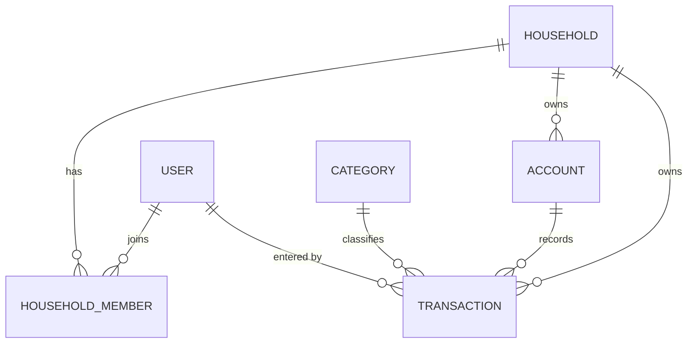

# Phase 1 — Data Model: Ghi Chép Thu Nhập và Chi Phí

**Date**: 2026-07-06 · **Feature**: 002-transaction-tracking · **Plan**: [plan.md](./plan.md) ·
**Nguồn**: [entity-model.md](../entities/entity-model.md) · [spec.md](./spec.md) · [research.md](./research.md)

Mô hình dữ liệu (Supabase/PostgreSQL) phần MỚI/MỞ RỘNG của feature 002. Các bảng
`households`, `household_members`, `categories`, `categorization_rules` giữ nguyên theo
[data-model của 001](../001-transaction-categorization/data-model.md).

## Sơ đồ thực thể (phạm vi feature)

> `USER` = `public.users` **độc lập** (R15 — không FK sang hệ xác thực; phiên đối chiếu qua email
> bằng `current_user_id()`). Số dư tài khoản là **giá trị suy ra** qua view `account_balances` (R16).

## USER (`users`) — migration `0011_users.sql` (đã viết, nền tảng ĐẦU TIÊN)

Danh bạ người dùng độc lập — nguồn định danh duy nhất của hệ thống.

| Field | Type (Postgres) | Validation / Ràng buộc | Nguồn |
|-------|-----------------|------------------------|-------|
| id | uuid (PK, default gen_random_uuid) | Primary Key — **độc lập, không FK auth** | FR-015, R15 |
| email | text | Not Null, **Unique** — danh tính đăng nhập, khóa đối chiếu phiên | FR-015, FR-016 |
| display_name | text | Not Null — hiển thị trong sổ thay cho mã định danh | FR-008 |
| created_at | timestamptz | Not Null, default now() | — |

**Constraints & hạ tầng kèm theo (0011)**: backfill hồ sơ từ tài khoản hiện có; hàm
`current_user_id()` (đối chiếu email phiên → users.id, SECURITY DEFINER STABLE); trigger
`set_created_by` gán `created_by := coalesce(current_user_id(), created_by)` trên
households/categories/transactions; `is_member()`/policy `member_self` chuyển sang so với
`current_user_id()`; RLS users: SELECT chính mình + người cùng hộ (`shares_household`), UPDATE/INSERT
chỉ chính mình (theo email). FK repoint: `household_members.user_id`, `households/categories/
transactions.created_by` → `users(id)`.

## ACCOUNT (`accounts`) — migration `0012_accounts.sql` (mới)

Nguồn tiền của hộ mà giao dịch được ghi vào (thu gọn từ BR-005 — R17).

| Field | Type (Postgres) | Validation / Ràng buộc | Nguồn |
|-------|-----------------|------------------------|-------|
| id | uuid (PK, default gen_random_uuid) | Primary Key | — |
| household_id | uuid (FK → households.id, on delete cascade) | Not Null; RLS theo membership | FR-006, R17 |
| name | text | Not Null (vd "Tiền mặt") | BR-ACC-002 |
| type | text | Not Null; ∈ {`CASH`,`BANK`,`EWALLET`,`CREDIT`}; default `CASH` | BR-ACC-001 |
| initial_balance | numeric(14,2) | Not Null, default 0 — số dư ban đầu (BR-005 dùng sau) | BR-ACC-002 |
| created_by | uuid (FK → users.id) | Optional (audit; trigger tự gán) | R15 |
| created_at | timestamptz | Not Null, default now() | — |

**Constraints**: seed **"Tiền mặt" (CASH)** cho mọi hộ hiện có + trigger `seed_default_account`
after insert on `households` (R17) → bảo đảm hộ luôn có ≥ 1 tài khoản (edge case spec). Xóa/sửa
tài khoản đầy đủ thuộc BR-005 (ngoài phạm vi — chỉ SELECT trong 002).

## TRANSACTION (`transactions`) — migration `0013_transactions_v2.sql` (mở rộng bảng 001)

Bút toán Thu/Chi đầy đủ vòng đời nhập/sửa/xóa.

| Field | Type (Postgres) | Validation / Ràng buộc | Nguồn |
|-------|-----------------|------------------------|-------|
| *(giữ từ 001)* id, household_id, created_by, amount, type, category_id, description, transaction_date | — | amount > 0; type ∈ INCOME/EXPENSE; category NOT NULL cùng loại & cùng hộ (`enforce_txn_rules`); description ≤ 255 | FR-001…005, BR-TRK-001…005 |
| **account_id** (MỚI) | uuid (FK → accounts.id, on delete restrict) | **Not Null** (backfill về tài khoản mặc định của hộ); cùng `household_id` với giao dịch | FR-006, BR-TRK-006 |
| **updated_at** (MỚI) | timestamptz | Not Null, default now(); trigger `touch_updated_at` (tái dùng 001) — mốc cập nhật lạc quan | FR-014, R20 |

**Constraints mới (0013)**
- `enforce_txn_rules` mở rộng: thêm kiểm `account_id` cùng hộ; **chặn `transaction_date` ở tương lai**
  (nới +1 ngày múi giờ — R18) — FR-005.
- UPDATE/DELETE qua điều kiện mốc `updated_at` phía client (R20) — không ghi đè thầm lặng (FR-014).
- Grants + RLS `member_transactions` giữ nguyên từ 001 (membership qua `current_user_id()` — 0011).

## ACCOUNT_BALANCES (view) — trong `0012_accounts.sql`

Số dư suy ra — luôn khớp tổng bút toán (SC-004, R16).

| Field | Type | Định nghĩa |
|-------|------|-----------|
| account_id | uuid | = accounts.id |
| household_id | uuid | = accounts.household_id (để RLS/lọc) |
| balance | numeric | `initial_balance + Σ(amount · CASE type WHEN 'INCOME' THEN 1 ELSE -1 END)` trên giao dịch của tài khoản |

**Constraints**: view thường (không materialized) — `security_invoker` để RLS của bảng gốc áp dụng;
index `idx_transactions_account` phục vụ tổng hợp.

## Quy tắc toàn vẹn xuyên thực thể (tóm tắt → truy vết)

| Bất biến | Thực thi | Truy vết |
|----------|----------|----------|
| Người dùng là nguồn định danh duy nhất; phiên đối chiếu qua email | `users` + `current_user_id()` + FK repoint + trigger `set_created_by` | FR-015, FR-016, R15 |
| Giao dịch đủ trường bắt buộc, đúng loại, cùng hộ | NOT NULL + `enforce_txn_rules` (type, category-hộ, account-hộ) | FR-001…007, SC-003 |
| Không ngày tương lai | client picker + `enforce_txn_rules` (R18) | FR-005 |
| Số dư luôn khớp tổng bút toán | view `account_balances` (giá trị suy ra) | FR-011, SC-004, R16 |
| Hộ luôn có ≥ 1 tài khoản | seed + trigger `seed_default_account` | FR-006, R17 |
| Sổ chung trong hộ, cô lập giữa hộ; hiển thị TÊN người nhập | RLS membership + embed `users(display_name)` | FR-008, FR-012, R19 |
| Ngang quyền sửa/xóa; không ghi đè thầm lặng | RLS không gác theo người tạo + mốc `updated_at` (R20) | FR-013, FR-014, SC-007 |
| Xóa luôn có xác nhận | UI (dialog) — DB không cascade ngầm liên quan | FR-010, SC-005 |

## History

- v1 (2026-07-06): tạo cho feature 002 — users (0011, đã viết) · accounts + view account_balances
  (0012) · transactions mở rộng account_id/updated_at + chặn ngày tương lai (0013). Dẫn xuất từ
  entity-model.md (đã cập nhật cùng ngày).
