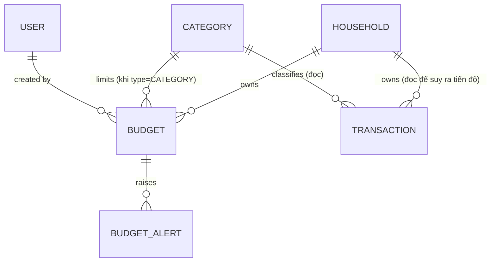

# Phase 1 — Data Model: Thiết Lập Ngân Sách (Go + Vue, PostgreSQL tự quản)

**Date**: 2026-07-13 · **Feature**: 003-budgeting · **Plan**: [plan.md](./plan.md) ·
**Nguồn**: [entity-model.md](../entities/entity-model.md) · [spec.md](./spec.md) · [research.md](./research.md)

Phần MỚI của feature 003 trên nền [data-model 001](../001-transaction-categorization/data-model.md) +
[data-model 002](../002-transaction-tracking/data-model.md) — `users, households, household_members,
categories, categorization_rules, accounts, transactions` giữ nguyên. Ngân sách chỉ **đọc** `transactions`
+ `categories`; không sửa/thêm cột lên chúng. Không RLS/trigger — bất biến ở biz (D3/001), phạm vi hộ ở
API middleware (D5/001).

## Sơ đồ thực thể (phạm vi feature)

## BUDGET (`budgets`) — migration `00008_budgets.sql` (mới)

Giới hạn chi tiêu của hộ trong một kỳ; tiến độ là **giá trị suy ra**, không lưu (D21).

| Field | Type (Postgres) | Validation / Ràng buộc | Nguồn |
|-------|-----------------|------------------------|-------|
| id | uuid (PK, default gen_random_uuid()) | Primary Key | — |
| household_id | uuid (FK → households.id) | Not Null; index; phạm vi hộ ở API | FR-011, D5/001 |
| type | text | Not Null; CHECK ∈ {`CATEGORY`,`TOTAL`} | FR-001, FR-002 |
| category_id | uuid (FK → categories.id) | **Not Null khi type=CATEGORY, Null khi TOTAL** (CHECK); phải loại `EXPENSE` & cùng hộ (**biz**) | FR-001, D21 |
| limit_amount | numeric(14,2) | Not Null; CHECK `> 0` | FR-003, BR-BGT-003 |
| period_type | text | Not Null; CHECK ∈ {`MONTHLY`,`WEEKLY`,`ONE_TIME`} | FR-004, BR-BGT-004 |
| start_date | date | Null trừ ONE_TIME (mốc bắt đầu kỳ một lần) | FR-004, D20 |
| end_date | date | Null trừ ONE_TIME; CHECK `end_date >= start_date` (**biz** + CHECK) | FR-004, D20 |
| status | text | Not Null; CHECK ∈ {`ACTIVE`,`ENDED`}; default `ACTIVE` | edge "kỳ kết thúc", D20 |
| created_by | uuid (FK → users.id) | Not Null (biz gán từ phiên) | FR-011 |
| created_at | timestamptz | Not Null, default now() | — |
| updated_at | timestamptz | Not Null, default now(); GORM hook — mốc lạc quan | FR-013, D25 |

**Ràng buộc duy nhất (partial unique index — D22, FR-010)**
- `unique (household_id, category_id, period_type) where status='ACTIVE' and type='CATEGORY'`
- `unique (household_id, period_type) where status='ACTIVE' and type='TOTAL'`

**Bất biến (biz — trong DB transaction)**
- `limit_amount > 0`, không phải số → `LIMIT_INVALID` (FR-003).
- type=CATEGORY: `category_id` bắt buộc, thuộc hộ, loại EXPENSE → `CATEGORY_REQUIRED`/`CATEGORY_TYPE_MISMATCH`/`CATEGORY_HOUSEHOLD_MISMATCH` (FR-001).
- type=TOTAL: `category_id` phải rỗng.
- ONE_TIME: `end_date >= start_date` → `PERIOD_INVALID` (FR-004).
- Trùng ngân sách ACTIVE (partial index) → `BUDGET_DUPLICATE` kèm id hiện có (FR-010).
- PATCH/DELETE kèm `expected_updated_at` → conditional write, `CONCURRENCY_CONFLICT`/`RECORD_GONE` (FR-013, D25).

**Kỳ hiện tại (suy ra — D20, không lưu)**: `period_key` = `YYYY-MM` (MONTHLY) · `IYYY-IW` (WEEKLY, tuần
ISO bắt đầu Thứ Hai) · `'once'` (ONE_TIME, cửa sổ `[start_date,end_date]`). MONTHLY/WEEKLY **tự lặp** trên
cùng một hàng — `period_key` đổi theo lịch → tiến độ & cảnh báo reset (FR-004). ONE_TIME → `status=ENDED`
khi `now() > end_date` (giữ để xem lại, không cảnh báo — edge case).

## BUDGET_ALERT (`budget_alerts`) — migration `00009_budget_alerts.sql` (mới)

Ghi nhận một lần phát cảnh báo của ngân sách trong một kỳ — hiển thị in-app & chống phát trùng (D23, FR-009).

| Field | Type (Postgres) | Validation / Ràng buộc | Nguồn |
|-------|-----------------|------------------------|-------|
| id | uuid (PK, default gen_random_uuid()) | Primary Key | — |
| budget_id | uuid (FK → budgets.id, **on delete cascade**) | Not Null; index | FR-009 |
| period_key | text | Not Null (khóa kỳ — D20) | FR-009 |
| level | text | Not Null; CHECK ∈ {`THRESHOLD_80`,`OVER_100`} | FR-007, FR-008 |
| over_amount | numeric(14,2) | Null trừ OVER_100 (= spent − limit) | FR-008, SC-005 |
| fired_at | timestamptz | Not Null, default now() | FR-007/008 |

**Ràng buộc**: `unique (budget_id, period_key, level)` — tối đa một lần/mức/kỳ (FR-009). Cascade theo
`budget_id` → xóa ngân sách gỡ luôn cảnh báo (UC-BGT-06). Máy trạng thái (evaluator — D24) **insert** khi
vượt mức lần đầu trong kỳ, **delete** khi tiến độ tụt xuống dưới mức (nạp lại để phát lại — US3 #4).

## BUDGET_PROGRESS (suy ra — không phải bảng, D21)

Giá trị tính ở biz khi đọc, embed vào response `GET /api/budgets`.

| Field | Định nghĩa |
|-------|-----------|
| period_key | Kỳ hiện tại của ngân sách (D20) |
| spent | `Σ transactions.amount` với `type='EXPENSE'`, cùng hộ, `transaction_date ∈ cửa sổ kỳ`, và **CATEGORY**: `category_id IN (budget.category_id + danh mục con một cấp)` · **TOTAL**: mọi giao dịch EXPENSE của hộ |
| percent | `round(spent / limit_amount × 100)` |
| alerts | Danh sách `budget_alerts` đang hoạt động của `period_key` hiện tại (level + over_amount + fired_at) |

**Bất biến**: chỉ tính loại `EXPENSE` (giao dịch Thu không bao giờ vào ngân sách — Assumptions); danh mục con
một cấp (cây danh mục 001 — D10/001); tính lại đúng sau khi giao dịch thêm/sửa/xóa/đổi danh mục/loại, kể cả
quá khứ trong kỳ (SC-003).

## Quy tắc toàn vẹn xuyên thực thể (tóm tắt → truy vết)

| Bất biến | Thực thi | Truy vết |
|----------|----------|----------|
| Ngân sách danh mục gắn danh mục EXPENSE cùng hộ | biz validate + FK + CHECK type/category theo type | FR-001, SC-002 |
| Giới hạn > 0; kỳ hợp lệ (ONE_TIME end≥start) | biz + CHECK | FR-003, FR-004, SC-002 |
| Tối đa 1 ngân sách ACTIVE / (danh mục, kỳ) và / (tổng, kỳ) | partial unique index + biz (D22) | FR-010 |
| Tiến độ = tổng giao dịch EXPENSE liên quan trong kỳ (suy ra) | biz đọc `SUM` theo cửa sổ kỳ + subtree (D21) | FR-005, FR-006, SC-003 |
| Danh mục con tính vào ngân sách cha | `category_id IN (id + children)` (D21) | FR-006, US2 #6 |
| Cảnh báo 80%/vượt: tối đa 1 lần/kỳ, phát lại sau khi tụt dưới | `unique(budget,period_key,level)` + delete-khi-tụt (D23) | FR-007/008/009, SC-004 |
| Cảnh báo vượt hiển thị đúng số tiền vượt | `over_amount = spent − limit` (D23) | FR-008, SC-005 |
| Ngân sách dùng chung trong hộ, cô lập giữa hộ; ghi người tạo | middleware phạm vi hộ (D5/001) + `created_by` biz gán | FR-011 |
| Ngang quyền sửa/xóa; không ghi đè thầm lặng | không gác theo người tạo; `updated_at` conditional write (D25) | FR-012, FR-013 |
| Thay đổi hiển thị cho thành viên khác ≤ 5s | topic `budgets_changed` → WS refetch (D26) | SC-006 |
| Ngân sách chỉ đọc dữ liệu nguồn | budget storage chỉ SELECT trên transactions/categories | Assumptions spec |

## History

- v1 (2026-07-13, claude): tạo mới cho stack Go+Vue — thêm `budgets` (00008) + `budget_alerts` (00009);
  tiến độ là giá trị suy ra tính ở biz (không view, không cột spent — D21); period_key tự lặp (D20);
  partial unique index cho FR-010 (D22); máy trạng thái cảnh báo (D23). Kế thừa 001/002.
