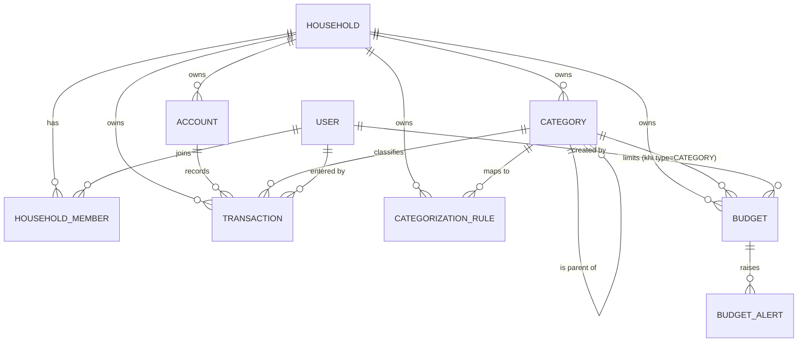

# Entity Model — Sổ tài chính hộ gia đình (feature 001 + 002 + 003)

**Nguồn**: [`BR-001`](../business-requirements/BR-001.md) · [`BR-002`](../business-requirements/BR-002.md) · [`BR-003`](../business-requirements/BR-003.md) · [spec 001](../001-transaction-categorization/spec.md) · [spec 002](../002-transaction-tracking/spec.md) · [spec 003](../003-budgeting/spec.md) · [UC-TRK-01…05](../use-cases/002-transaction-tracking/) · [UC-BGT-01…06](../use-cases/003-budgeting/) · [`data-model.md` (001)](../001-transaction-categorization/data-model.md)

> **Cập nhật 2026-06-29 — App dùng chung trong hộ gia đình**: Danh mục/giao dịch/quy tắc thuộc một **hộ** (`household_id`) thay vì người dùng; thêm `HOUSEHOLD` + `HOUSEHOLD_MEMBER`; giao dịch ghi rõ thành viên nhập (`created_by`). Cô lập **giữa các hộ**; chia sẻ **trong hộ** (FR-018 đã đổi). Mọi thành viên quyền ngang nhau.
>
> **Cập nhật 2026-07-06 — Feature 002 (Ghi chép thu chi)**: `USER` là **danh bạ độc lập** (nguồn định danh duy nhất — FR-015/002); thêm `ACCOUNT` (nguồn tiền của hộ — phụ thuộc BR-005, phạm vi 002 dùng tài khoản mặc định); `TRANSACTION` mở rộng vòng đời nhập/sửa/xóa với `account_id` + `updated_at` (chống ghi đè thầm lặng — FR-014/002).
>
> **Cập nhật 2026-07-13 — Feature 003 (Thiết lập ngân sách)**: thêm `BUDGET` (giới hạn chi theo danh mục hoặc tổng trong một kỳ; tiến độ là **giá trị suy ra** từ giao dịch, không lưu) + `BUDGET_ALERT` (ghi nhận lần phát cảnh báo 80%/vượt trong một kỳ — chống trùng & phát lại). Ngân sách chỉ **đọc** `TRANSACTION`/`CATEGORY` để suy ra tiến độ; không sửa dữ liệu nguồn (spec 003).

## Entity Relationship Diagram

### HOUSEHOLD

Một hộ gia đình — đơn vị sở hữu chung danh mục và giao dịch của các thành viên.

| Attribute  | Description                  | Data Type | Length/Precision | Validation Rules                |
|------------|------------------------------|-----------|------------------|---------------------------------|
| id         | Định danh duy nhất của hộ    | Long      | 19               | Primary Key, Sequence           |
| name       | Tên hộ gia đình              | String    | 100              | Not Null                        |
| created_by | Người dùng đã tạo hộ         | Long      | 19               | Not Null, Foreign Key (USER.id) |

### HOUSEHOLD_MEMBER

Liên kết một người dùng với một hộ; mọi thành viên có quyền ngang nhau (không có vai trò gác quyền).

| Attribute    | Description                          | Data Type | Length/Precision | Validation Rules                     |
|--------------|--------------------------------------|-----------|------------------|--------------------------------------|
| id           | Định danh duy nhất bản ghi thành viên | Long      | 19               | Primary Key, Sequence                |
| household_id | Hộ mà người dùng tham gia            | Long      | 19               | Not Null, Foreign Key (HOUSEHOLD.id) |
| user_id      | Người dùng là thành viên             | Long      | 19               | Not Null, Foreign Key (USER.id)      |
| joined_at    | Thời điểm tham gia hộ                | DateTime  | -                | Not Null                             |

**Constraints:** Duy nhất theo cặp `(household_id, user_id)` — mỗi người chỉ tham gia một hộ một lần. Không có cột vai trò (mọi thành viên ngang quyền). MVP: mỗi người dùng thuộc một hộ.

### USER

Danh bạ người dùng **độc lập** của hệ thống — nguồn định danh duy nhất mà thành viên hộ và mọi trường "người tạo/người nhập" tham chiếu tới; thuộc hộ qua HOUSEHOLD_MEMBER.

| Attribute    | Description                          | Data Type | Length/Precision | Validation Rules               |
|--------------|--------------------------------------|-----------|------------------|--------------------------------|
| id           | Định danh duy nhất của người dùng (độc lập, không phụ thuộc cơ chế xác thực) | Long | 19 | Primary Key, Sequence |
| email        | Email — danh tính đăng nhập, duy nhất trong hệ thống | String | 255 | Not Null, Unique, Format: Email |
| display_name | Tên hiển thị (hiện trong sổ chung thay cho mã định danh) | String | 100 | Not Null |

**Constraints:** Nguồn định danh duy nhất của hệ thống — mọi FK "người" (thành viên hộ, người tạo) tham chiếu về đây; thông tin xác thực (mật khẩu/phiên) được quản lý an toàn ở tầng hiện thực, không thuộc ý nghĩa nghiệp vụ của thực thể (FR-015, FR-016/002). Hồ sơ chưa có tên hiển thị thì dùng email. Mỗi người chỉ tự sửa hồ sơ của chính mình; thành viên cùng hộ thấy được tên nhau.

### CATEGORY

Một nhóm phân loại giao dịch dùng chung trong hộ (mặc định hoặc tự tạo), mang đúng một loại Thu/Chi cố định, có thể lồng một cấp dưới một danh mục cha.

| Attribute    | Description                                                     | Data Type | Length/Precision | Validation Rules                     |
|--------------|-----------------------------------------------------------------|-----------|------------------|--------------------------------------|
| id           | Định danh duy nhất của danh mục                                | Long      | 19               | Primary Key, Sequence                |
| household_id | Hộ sở hữu danh mục (dùng chung trong hộ)                       | Long      | 19               | Not Null, Foreign Key (HOUSEHOLD.id) |
| name         | Tên danh mục hiển thị cho thành viên                           | String    | 50               | Not Null                             |
| type         | Loại Thu/Chi cố định của danh mục                              | String    | 10               | Not Null, Values: INCOME, EXPENSE    |
| icon         | Biểu tượng tùy chọn đại diện cho danh mục                      | String    | 50               | Optional                             |
| is_default   | Cờ phân biệt danh mục mặc định hệ thống hay tự tạo             | Boolean   | 1                | Not Null                             |
| is_hidden    | Cờ ẩn danh mục khỏi danh sách chọn khi nhập giao dịch mới      | Boolean   | 1                | Not Null                             |
| parent_id    | Tham chiếu danh mục cha (rỗng nếu là danh mục gốc)             | Long      | 19               | Optional, Foreign Key (CATEGORY.id)  |
| created_by   | Thành viên đã tạo danh mục (audit)                            | Long      | 19               | Optional, Foreign Key (USER.id)      |
| updated_at   | Mốc sửa đổi cuối — cập nhật lạc quan giữa các thành viên (R13) | DateTime  | -                | Not Null                             |

**Constraints:** `type` không thể thay đổi sau khi tạo (FR-005). Danh mục con bắt buộc kế thừa `type` của cha và chỉ lồng đúng một cấp — `parent_id` phải trỏ tới một danh mục gốc (FR-010, FR-011). Cảnh báo khi `name` trùng trong cùng `(household_id, type, parent_id)` (FR-017). Danh mục cô lập giữa các hộ (FR-018 đã đổi). Sửa đồng thời bởi nhiều thành viên dùng `updated_at` làm mốc lạc quan — ghi lệch mốc bị từ chối và báo xung đột, không ghi đè thầm lặng (R13).

### ACCOUNT

Một nguồn tiền của hộ (tiền mặt, ngân hàng, ví điện tử, thẻ tín dụng) mà giao dịch được ghi vào — định nghĩa đầy đủ thuộc BR-005; phạm vi feature 002 chỉ cần mỗi giao dịch gắn một tài khoản và số dư phản ánh đúng tổng bút toán.

| Attribute    | Description                                              | Data Type | Length/Precision | Validation Rules                     |
|--------------|----------------------------------------------------------|-----------|------------------|--------------------------------------|
| id           | Định danh duy nhất của tài khoản                         | Long      | 19               | Primary Key, Sequence                |
| household_id | Hộ sở hữu tài khoản (dùng chung trong hộ)                | Long      | 19               | Not Null, Foreign Key (HOUSEHOLD.id) |
| name         | Tên tài khoản hiển thị cho thành viên (vd "Tiền mặt")    | String    | 100              | Not Null                             |
| type         | Loại nguồn tiền                                          | String    | 20               | Not Null, Values: CASH, BANK, EWALLET, CREDIT |
| balance      | Số dư hiện tại của tài khoản                             | Decimal   | 14,2             | Not Null                             |

**Constraints:** `balance` là **giá trị suy ra nhất quán** — luôn phản ánh đúng tổng các giao dịch liên quan sau mỗi thao tác thêm/sửa/xóa (FR-011/002, SC-004/002); không sửa tay ngoài cơ chế giao dịch điều chỉnh (BR-ACC-003 — thuộc BR-005). Mỗi hộ luôn có ít nhất một tài khoản mặc định để ghi giao dịch (Assumptions spec 002); quản lý nhiều tài khoản & chuyển tiền thuộc BR-005.

### TRANSACTION

Một bút toán Thu hoặc Chi dùng chung trong hộ; tham chiếu đúng một danh mục cùng loại và một tài khoản của hộ; ghi rõ thành viên đã nhập; sửa/xóa được bởi mọi thành viên (ngang quyền).

| Attribute        | Description                                            | Data Type | Length/Precision | Validation Rules                     |
|------------------|--------------------------------------------------------|-----------|------------------|--------------------------------------|
| id               | Định danh duy nhất của giao dịch                       | Long      | 19               | Primary Key, Sequence                |
| household_id     | Hộ sở hữu giao dịch (dùng chung trong hộ)             | Long      | 19               | Not Null, Foreign Key (HOUSEHOLD.id) |
| created_by       | Thành viên đã nhập giao dịch                           | Long      | 19               | Not Null, Foreign Key (USER.id)      |
| amount           | Số tiền của giao dịch                                  | Decimal   | 10,2             | Not Null, Min: 0                     |
| type             | Loại Thu/Chi của giao dịch, phải trùng loại danh mục   | String    | 10               | Not Null, Values: INCOME, EXPENSE    |
| category_id      | Danh mục được gán cho giao dịch                        | Long      | 19               | Not Null, Foreign Key (CATEGORY.id)  |
| account_id       | Tài khoản của hộ mà giao dịch được ghi vào             | Long      | 19               | Not Null, Foreign Key (ACCOUNT.id)   |
| description      | Mô tả tùy chọn cho giao dịch                           | String    | 255              | Optional                             |
| transaction_date | Ngày giờ phát sinh giao dịch                           | DateTime  | -                | Not Null                             |
| updated_at       | Mốc sửa đổi cuối — cập nhật lạc quan giữa các thành viên | DateTime | -                | Not Null                             |

**Constraints:** `type` của giao dịch BẮT BUỘC trùng `type` của danh mục được gán (FR-014/001, SC-003/001); danh mục, tài khoản và giao dịch phải cùng `household_id`. `amount` phải lớn hơn 0 (BR-TRK-001). Không thể lưu giao dịch nếu `category_id` rỗng (FR-013/001) hoặc `account_id` rỗng (BR-TRK-006). `transaction_date` mặc định hiện tại, sửa được về quá khứ, **không nhận ngày tương lai** (FR-005/002). Sửa giao dịch qua cùng bộ xác thực như nhập mới; đổi loại buộc chọn lại danh mục cùng loại (FR-009/002). Sửa/xóa đồng thời dùng `updated_at` làm mốc lạc quan — không ghi đè thầm lặng (FR-014/002). Xóa luôn qua bước xác nhận (FR-010/002).

### CATEGORIZATION_RULE

Ánh xạ từ khóa → danh mục (theo quy tắc và/hoặc học từ lịch sử phân loại chung của hộ) để gợi ý khi nhập giao dịch; tham khảo, luôn có thể ghi đè (FR-015).

| Attribute    | Description                                                  | Data Type | Length/Precision | Validation Rules                     |
|--------------|--------------------------------------------------------------|-----------|------------------|--------------------------------------|
| id           | Định danh duy nhất của quy tắc gợi ý                         | Long      | 19               | Primary Key, Sequence                |
| household_id | Hộ sở hữu quy tắc (học từ lịch sử chung của hộ)             | Long      | 19               | Not Null, Foreign Key (HOUSEHOLD.id) |
| keyword      | Từ khóa/cụm từ đối chiếu với mô tả giao dịch                 | String    | 100              | Not Null                             |
| match_count  | Số lần ánh xạ này được xác nhận từ lịch sử phân loại         | Integer   | 10               | Not Null, Min: 0                     |
| category_id  | Danh mục được đề xuất cho các giao dịch khớp                 | Long      | 19               | Not Null, Foreign Key (CATEGORY.id)  |

**Constraints:** Danh mục được gợi ý phải cùng loại Thu/Chi với giao dịch đang nhập (FR-015). Gợi ý không bao giờ ép buộc — thành viên luôn có thể chấp nhận hoặc chọn danh mục khác (FR-015).

### BUDGET

Giới hạn chi tiêu của hộ trong một kỳ — theo một danh mục Chi cụ thể hoặc theo tổng chi của hộ; dùng chung trong hộ, mọi thành viên ngang quyền tạo/sửa/xóa. Tiến độ (đã chi/giới hạn) là **giá trị suy ra** từ giao dịch, không lưu cứng.

| Attribute    | Description                                                       | Data Type | Length/Precision | Validation Rules                              |
|--------------|-------------------------------------------------------------------|-----------|------------------|-----------------------------------------------|
| id           | Định danh duy nhất của ngân sách                                  | Long      | 19               | Primary Key, Sequence                         |
| household_id | Hộ sở hữu ngân sách (dùng chung trong hộ)                         | Long      | 19               | Not Null, Foreign Key (HOUSEHOLD.id)          |
| type         | Loại ngân sách: theo danh mục hay tổng chi tiêu                   | String    | 10               | Not Null, Values: CATEGORY, TOTAL             |
| category_id  | Danh mục Chi được giới hạn (chỉ khi type=CATEGORY)                | Long      | 19               | Bắt buộc & loại EXPENSE khi CATEGORY; rỗng khi TOTAL; Foreign Key (CATEGORY.id) |
| limit_amount | Số tiền giới hạn của kỳ                                           | Decimal   | 14,2             | Not Null, > 0                                 |
| period_type  | Kỳ áp dụng                                                        | String    | 10               | Not Null, Values: MONTHLY, WEEKLY, ONE_TIME   |
| start_date   | Ngày bắt đầu (chỉ kỳ ONE_TIME)                                    | Date      | -                | Bắt buộc khi ONE_TIME                          |
| end_date     | Ngày kết thúc (chỉ kỳ ONE_TIME)                                   | Date      | -                | Bắt buộc khi ONE_TIME; không trước start_date |
| status       | Trạng thái vòng đời                                               | String    | 10               | Not Null, Values: ACTIVE, ENDED               |
| created_by   | Thành viên đã tạo ngân sách                                       | Long      | 19               | Not Null, Foreign Key (USER.id)               |
| updated_at   | Mốc sửa đổi cuối — cập nhật lạc quan giữa các thành viên           | DateTime  | -                | Not Null                                      |

**Constraints:** `limit_amount` phải > 0 (BR-BGT-003). type=CATEGORY bắt buộc `category_id` là danh mục **loại Chi** cùng hộ; type=TOTAL không gắn danh mục (FR-001/002). Kỳ MONTHLY (tháng dương lịch)/WEEKLY (bắt đầu Thứ Hai) **tự lặp lại** mỗi kỳ với cùng giới hạn — tiến độ & cảnh báo bắt đầu lại từ 0; ONE_TIME có khoảng ngày xác định, chuyển ENDED khi qua ngày kết thúc (FR-004). Tối đa **một ngân sách ACTIVE mỗi (danh mục, kỳ)** và mỗi (tổng, kỳ) trong một hộ (FR-010). Tiến độ = tổng giao dịch **loại Chi** liên quan trong kỳ (danh mục + danh mục con một cấp, hoặc toàn bộ chi với ngân sách tổng) — giá trị suy ra, tính lại đúng khi giao dịch thêm/sửa/xóa/đổi danh mục kể cả quá khứ (FR-006). Sửa/xóa ngang quyền, chống ghi đè thầm lặng qua `updated_at` (FR-012/013). Ngân sách chỉ **đọc** giao dịch/danh mục.

### BUDGET_ALERT

Ghi nhận một lần phát cảnh báo của một ngân sách trong một kỳ — dùng để hiển thị in-app và **chống phát trùng** cùng mức trong kỳ (FR-009).

| Attribute   | Description                                              | Data Type | Length/Precision | Validation Rules                          |
|-------------|----------------------------------------------------------|-----------|------------------|-------------------------------------------|
| id          | Định danh duy nhất của bản ghi cảnh báo                  | Long      | 19               | Primary Key, Sequence                     |
| budget_id   | Ngân sách phát cảnh báo                                  | Long      | 19               | Not Null, Foreign Key (BUDGET.id)         |
| period_key  | Khóa kỳ áp dụng (cảnh báo reset khi sang kỳ mới)         | String    | 20               | Not Null                                  |
| level       | Mức cảnh báo                                             | String    | 15               | Not Null, Values: THRESHOLD_80, OVER_100  |
| over_amount | Số tiền vượt giới hạn (chỉ khi vượt 100%)                | Decimal   | 14,2             | Bắt buộc khi OVER_100; rỗng khi THRESHOLD_80 |
| fired_at    | Thời điểm phát cảnh báo                                  | DateTime  | -                | Not Null                                  |

**Constraints:** Duy nhất theo `(budget_id, period_key, level)` — mỗi mức phát tối đa một lần trong một kỳ (FR-009). Khi tiến độ tụt xuống dưới mức (do sửa/xóa giao dịch), bản ghi cảnh báo của mức đó trong kỳ bị gỡ để có thể **phát lại** khi vượt lần nữa (US3 #4). `over_amount = đã chi − giới hạn` cho mức vượt, hiển thị đúng số tiền vượt (SC-005). Xóa ngân sách gỡ cascade các cảnh báo liên quan (UC-BGT-06).

## History

- 2026-07-06: Thêm `CATEGORY.updated_at` (mốc cập nhật lạc quan đa thành viên — R13/T050); đồng bộ với `data-model.md` và `contracts/db-schema.sql`.
- 2026-07-06 (feature 002): `USER` được hiện thực hóa thành bảng người dùng **độc lập** của app (định danh riêng; email duy nhất; tên hiển thị; phiên đăng nhập nối qua email — credentials do hệ thống xác thực quản lý riêng); mọi FK người dùng (thành viên hộ, người tạo) tham chiếu bảng này (migration `0011_users.sql`).
- 2026-07-06 (feature 002 — entity model từ UC-TRK-01…05 + BR-002): tổng quát hóa tiêu đề (001+002); cập nhật bảng thuộc tính `USER` (email unique, `display_name`, constraints độc lập/đối chiếu qua email); thêm thực thể **`ACCOUNT`** (nguồn tiền của hộ — BR-005, phạm vi 002 dùng tài khoản mặc định, `balance` là giá trị suy ra); `TRANSACTION` thêm `account_id` + `updated_at` và constraints vòng đời nhập/sửa/xóa (ngày không tương lai, xác nhận khi xóa, chống ghi đè thầm lặng — FR-005/009/010/014 của spec 002).
- 2026-07-10 (re-platform Go+Vue): gỡ mô tả cơ chế của stack cũ khỏi `USER` (đối chiếu phiên qua email, backfill hồ sơ từ hệ xác thực cũ) — thông tin xác thực là chi tiết tầng hiện thực; **cấu trúc thực thể & quan hệ KHÔNG đổi**. Các đường dẫn migration trong dòng history cũ là di sản (`src/supabase/migrations/...` → nay `src/db/migrations/` với goose).
- 2026-07-13 (feature 003 — Thiết lập ngân sách, từ BR-003 + spec 003 + UC-BGT-01…06): thêm thực thể **`BUDGET`** (giới hạn chi theo danh mục/tổng trong một kỳ; tiến độ là giá trị suy ra từ giao dịch — không lưu; kỳ tự lặp; tối đa 1 ngân sách ACTIVE/danh mục/kỳ — FR-010) và **`BUDGET_ALERT`** (ghi nhận phát cảnh báo 80%/vượt trong một kỳ, chống trùng theo `(budget_id, period_key, level)` + phát lại — FR-009); quan hệ HOUSEHOLD owns BUDGET, CATEGORY limits BUDGET (khi type=CATEGORY), BUDGET raises BUDGET_ALERT, USER created BUDGET. Ngân sách chỉ đọc TRANSACTION/CATEGORY. Migrations goose `00008_budgets` · `00009_budget_alerts` (data-model 003).
