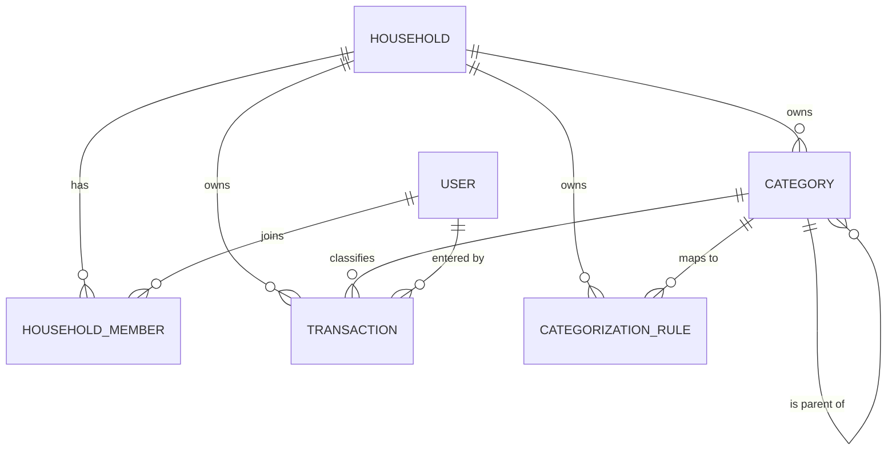

# Entity Model — Phân loại giao dịch (Transaction Categorization)

**Nguồn**: [`specs/001-transaction-categorization/spec.md`](../001-transaction-categorization/spec.md) · [`BR-001`](../business-requirements/BR-001.md) · [`BR-002`](../business-requirements/BR-002.md) (Giao dịch) · [`plan.md`](../001-transaction-categorization/plan.md) · [`data-model.md`](../001-transaction-categorization/data-model.md)

> **Cập nhật 2026-06-29 — App dùng chung trong hộ gia đình**: Danh mục/giao dịch/quy tắc thuộc một **hộ** (`household_id`) thay vì người dùng; thêm `HOUSEHOLD` + `HOUSEHOLD_MEMBER`; giao dịch ghi rõ thành viên nhập (`created_by`). Cô lập **giữa các hộ**; chia sẻ **trong hộ** (FR-018 đã đổi). Mọi thành viên quyền ngang nhau.

## Entity Relationship Diagram

### HOUSEHOLD

Một hộ gia đình — đơn vị sở hữu chung danh mục và giao dịch của các thành viên.

| Attribute  | Description                  | Data Type | Length/Precision | Validation Rules                |
|------------|------------------------------|-----------|------------------|---------------------------------|
| id         | Định danh duy nhất của hộ    | Long      | 19               | Primary Key, Sequence           |
| name       | Tên hộ gia đình              | String    | 100              | Not Null                        |
| created_by | Người dùng đã tạo hộ         | Long      | 19               | Not Null, Foreign Key (USER.id) |

### HOUSEHOLD_MEMBER

Liên kết một người dùng với một hộ; mọi thành viên có quyền ngang nhau (không có vai trò gác quyền).

| Attribute    | Description                          | Data Type | Length/Precision | Validation Rules                     |
|--------------|--------------------------------------|-----------|------------------|--------------------------------------|
| id           | Định danh duy nhất bản ghi thành viên | Long      | 19               | Primary Key, Sequence                |
| household_id | Hộ mà người dùng tham gia            | Long      | 19               | Not Null, Foreign Key (HOUSEHOLD.id) |
| user_id      | Người dùng là thành viên             | Long      | 19               | Not Null, Foreign Key (USER.id)      |
| joined_at    | Thời điểm tham gia hộ                | DateTime  | -                | Not Null                             |

**Constraints:** Duy nhất theo cặp `(household_id, user_id)` — mỗi người chỉ tham gia một hộ một lần. Không có cột vai trò (mọi thành viên ngang quyền). MVP: mỗi người dùng thuộc một hộ.

### USER

Một tài khoản người dùng; thuộc hộ qua HOUSEHOLD_MEMBER và là người nhập giao dịch.

| Attribute | Description                          | Data Type | Length/Precision | Validation Rules               |
|-----------|--------------------------------------|-----------|------------------|--------------------------------|
| id        | Định danh duy nhất của người dùng    | Long      | 19               | Primary Key, Sequence          |
| name      | Tên hiển thị của người dùng          | String    | 100              | Not Null                       |
| email     | Email đăng nhập                      | String    | 255              | Not Null, Unique, Format: Email |

### CATEGORY

Một nhóm phân loại giao dịch dùng chung trong hộ (mặc định hoặc tự tạo), mang đúng một loại Thu/Chi cố định, có thể lồng một cấp dưới một danh mục cha.

| Attribute    | Description                                                     | Data Type | Length/Precision | Validation Rules                     |
|--------------|-----------------------------------------------------------------|-----------|------------------|--------------------------------------|
| id           | Định danh duy nhất của danh mục                                | Long      | 19               | Primary Key, Sequence                |
| household_id | Hộ sở hữu danh mục (dùng chung trong hộ)                       | Long      | 19               | Not Null, Foreign Key (HOUSEHOLD.id) |
| name         | Tên danh mục hiển thị cho thành viên                           | String    | 50               | Not Null                             |
| type         | Loại Thu/Chi cố định của danh mục                              | String    | 10               | Not Null, Values: INCOME, EXPENSE    |
| icon         | Biểu tượng tùy chọn đại diện cho danh mục                      | String    | 50               | Optional                             |
| is_default   | Cờ phân biệt danh mục mặc định hệ thống hay tự tạo             | Boolean   | 1                | Not Null                             |
| is_hidden    | Cờ ẩn danh mục khỏi danh sách chọn khi nhập giao dịch mới      | Boolean   | 1                | Not Null                             |
| parent_id    | Tham chiếu danh mục cha (rỗng nếu là danh mục gốc)             | Long      | 19               | Optional, Foreign Key (CATEGORY.id)  |
| created_by   | Thành viên đã tạo danh mục (audit)                            | Long      | 19               | Optional, Foreign Key (USER.id)      |
| updated_at   | Mốc sửa đổi cuối — cập nhật lạc quan giữa các thành viên (R13) | DateTime  | -                | Not Null                             |

**Constraints:** `type` không thể thay đổi sau khi tạo (FR-005). Danh mục con bắt buộc kế thừa `type` của cha và chỉ lồng đúng một cấp — `parent_id` phải trỏ tới một danh mục gốc (FR-010, FR-011). Cảnh báo khi `name` trùng trong cùng `(household_id, type, parent_id)` (FR-017). Danh mục cô lập giữa các hộ (FR-018 đã đổi). Sửa đồng thời bởi nhiều thành viên dùng `updated_at` làm mốc lạc quan — ghi lệch mốc bị từ chối và báo xung đột, không ghi đè thầm lặng (R13).

### TRANSACTION

Một bút toán Thu hoặc Chi dùng chung trong hộ; tham chiếu đúng một danh mục cùng loại và ghi rõ thành viên đã nhập (mô hình đầy đủ thuộc BR-002).

| Attribute        | Description                                            | Data Type | Length/Precision | Validation Rules                     |
|------------------|--------------------------------------------------------|-----------|------------------|--------------------------------------|
| id               | Định danh duy nhất của giao dịch                       | Long      | 19               | Primary Key, Sequence                |
| household_id     | Hộ sở hữu giao dịch (dùng chung trong hộ)             | Long      | 19               | Not Null, Foreign Key (HOUSEHOLD.id) |
| created_by       | Thành viên đã nhập giao dịch                           | Long      | 19               | Not Null, Foreign Key (USER.id)      |
| amount           | Số tiền của giao dịch                                  | Decimal   | 10,2             | Not Null, Min: 0                     |
| type             | Loại Thu/Chi của giao dịch, phải trùng loại danh mục   | String    | 10               | Not Null, Values: INCOME, EXPENSE    |
| category_id      | Danh mục được gán cho giao dịch                        | Long      | 19               | Not Null, Foreign Key (CATEGORY.id)  |
| description      | Mô tả tùy chọn cho giao dịch                           | String    | 255              | Optional                             |
| transaction_date | Ngày giờ phát sinh giao dịch                           | DateTime  | -                | Not Null                             |

**Constraints:** `type` của giao dịch BẮT BUỘC trùng `type` của danh mục được gán (FR-014, SC-003); danh mục và giao dịch phải cùng `household_id`. `amount` phải lớn hơn 0 (BR-TRK-001). Không thể lưu giao dịch nếu `category_id` rỗng (FR-013, SC-002). Tài khoản & cập nhật số dư thuộc BR-002, không mô hình hóa tại đây.

### CATEGORIZATION_RULE

Ánh xạ từ khóa → danh mục (theo quy tắc và/hoặc học từ lịch sử phân loại chung của hộ) để gợi ý khi nhập giao dịch; tham khảo, luôn có thể ghi đè (FR-015).

| Attribute    | Description                                                  | Data Type | Length/Precision | Validation Rules                     |
|--------------|--------------------------------------------------------------|-----------|------------------|--------------------------------------|
| id           | Định danh duy nhất của quy tắc gợi ý                         | Long      | 19               | Primary Key, Sequence                |
| household_id | Hộ sở hữu quy tắc (học từ lịch sử chung của hộ)             | Long      | 19               | Not Null, Foreign Key (HOUSEHOLD.id) |
| keyword      | Từ khóa/cụm từ đối chiếu với mô tả giao dịch                 | String    | 100              | Not Null                             |
| match_count  | Số lần ánh xạ này được xác nhận từ lịch sử phân loại         | Integer   | 10               | Not Null, Min: 0                     |
| category_id  | Danh mục được đề xuất cho các giao dịch khớp                 | Long      | 19               | Not Null, Foreign Key (CATEGORY.id)  |

**Constraints:** Danh mục được gợi ý phải cùng loại Thu/Chi với giao dịch đang nhập (FR-015). Gợi ý không bao giờ ép buộc — thành viên luôn có thể chấp nhận hoặc chọn danh mục khác (FR-015).

## History

- 2026-07-06: Thêm `CATEGORY.updated_at` (mốc cập nhật lạc quan đa thành viên — R13/T050); đồng bộ với `data-model.md` và `contracts/db-schema.sql`.
