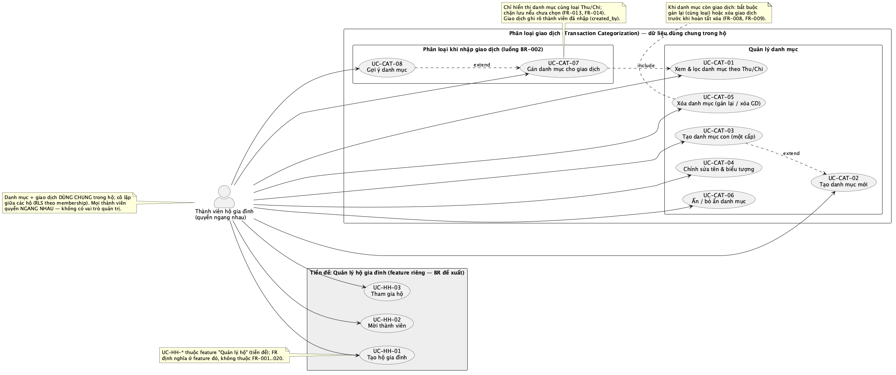

# Use Cases — Phân Loại Giao Dịch (Transaction Categorization)

**Nguồn**: [`specs/001-transaction-categorization/spec.md`](../001-transaction-categorization/spec.md) · [`BR-001`](../business-requirements/BR-001.md) · [`plan.md`](../001-transaction-categorization/plan.md)

**Tác nhân chính**: Thành viên hộ gia đình (quyền ngang nhau, dùng chung sổ tài chính của hộ).

> ⚠️ **Cập nhật 2026-06-29**: App dùng chung trong **hộ gia đình** — danh mục & giao dịch chia sẻ trong hộ, cô lập giữa các hộ; mọi thành viên quyền ngang nhau. Điều này **đảo ngược FR-018** (vốn ghi "riêng từng người dùng"); `spec.md` cần được cập nhật tương ứng (xem plan.md "Tác động tới spec").

Các use case dưới đây mô tả cách thành viên hộ tương tác với hệ thống danh mục để
bảo đảm **mọi giao dịch đều được gán đúng một danh mục phù hợp**. Mỗi use case là
một file riêng theo mẫu chuẩn (tác nhân, tiền điều kiện, luồng chính, luồng thay
thế/ngoại lệ, hậu điều kiện, quy tắc nghiệp vụ, truy vết).

## Danh sách Use Case

| Mã | Use Case | User Story | Truy vết FR | Sơ đồ |
|----|----------|------------|-------------|:-----:|
| [UC-CAT-01](./uc-cat-01-xem-loc-danh-muc.md) | Xem & lọc danh mục theo loại Thu/Chi | US1 | FR-002, FR-004, FR-014 | ✅ |
| [UC-CAT-02](./uc-cat-02-tao-danh-muc.md) | Tạo danh mục mới | US2 | FR-003, FR-004, FR-005, FR-017, FR-018 | ✅ |
| [UC-CAT-03](./uc-cat-03-tao-danh-muc-con.md) | Tạo danh mục con (một cấp) | US3 | FR-010, FR-011, FR-017 | ✅ |
| [UC-CAT-04](./uc-cat-04-chinh-sua-danh-muc.md) | Chỉnh sửa tên & biểu tượng danh mục | US2 | FR-006, FR-016, FR-017 | ✅ |
| [UC-CAT-05](./uc-cat-05-xoa-danh-muc.md) | Xóa danh mục (gán lại / xóa giao dịch) | US2, US3 | FR-007, FR-008, FR-009, FR-012 | ✅ |
| [UC-CAT-06](./uc-cat-06-an-bo-an-danh-muc.md) | Ẩn / bỏ ẩn danh mục | Edge case | FR-020 | ✅ |
| [UC-CAT-07](./uc-cat-07-gan-danh-muc-giao-dich.md) | Gán danh mục cho giao dịch | US1 | FR-013, FR-014, FR-019 | ✅ |
| [UC-CAT-08](./uc-cat-08-goi-y-danh-muc.md) | Gợi ý danh mục khi nhập giao dịch | US4 | FR-015 | ✅ |

> **Sơ đồ** ✅ = use case đã được đưa vào sơ đồ use case PlantUML
> ([`specs/diagrams/use-cases.puml`](../diagrams/use-cases.puml)). Toàn bộ 8/8 use case đã hoàn tất và đã có trên sơ đồ.

## Sơ đồ quan hệ (rút gọn)

> Sơ đồ use case đầy đủ (PlantUML): [`specs/diagrams/use-cases.puml`](../diagrams/use-cases.puml) · ảnh render: [`use-cases.png`](../diagrams/use-cases.png)



```
Thành viên hộ gia đình  (quyền ngang nhau — dữ liệu dùng chung trong hộ)
   │
   ├── Quản lý danh mục
   │     ├── UC-CAT-01  Xem & lọc danh mục
   │     ├── UC-CAT-02  Tạo danh mục mới
   │     ├── UC-CAT-03  Tạo danh mục con      «extend» UC-CAT-02
   │     ├── UC-CAT-04  Chỉnh sửa danh mục
   │     ├── UC-CAT-05  Xóa danh mục          «include» gán lại giao dịch
   │     └── UC-CAT-06  Ẩn / bỏ ẩn danh mục
   │
   ├── Phân loại giao dịch (luồng BR-002)
   │     ├── UC-CAT-07  Gán danh mục cho giao dịch   «include» UC-CAT-01 (lọc theo loại)
   │     └── UC-CAT-08  Gợi ý danh mục               «extend» UC-CAT-07
   │
   └── Tiền đề: Quản lý hộ (feature riêng — chưa có FR ở feature này)
         ├── UC-HH-01  Tạo hộ gia đình
         ├── UC-HH-02  Mời thành viên
         └── UC-HH-03  Tham gia hộ
```

## Ghi chú phạm vi

- Việc **nhập giao dịch** đầy đủ (số tiền, ngày, tài khoản…) thuộc BR-002; các use
  case ở đây chỉ bao phủ phần **danh mục** của luồng đó.
- Danh mục & giao dịch **dùng chung trong hộ gia đình** — chia sẻ giữa các thành viên cùng hộ, **cô lập giữa các hộ** khác nhau (FR-018 cần cập nhật theo mô hình hộ).
- Mọi thành viên **quyền ngang nhau**; giao dịch ghi rõ **thành viên đã nhập** (`created_by`).
- Chỉ hỗ trợ **một cấp** danh mục con (cha → con); nhiều hơn một cấp nằm ngoài phạm vi.
- **Quản lý hộ** (tạo hộ, mời/tham gia) là **tiền đề** thuộc feature riêng (UC-HH-*), chưa có FR trong feature này.
